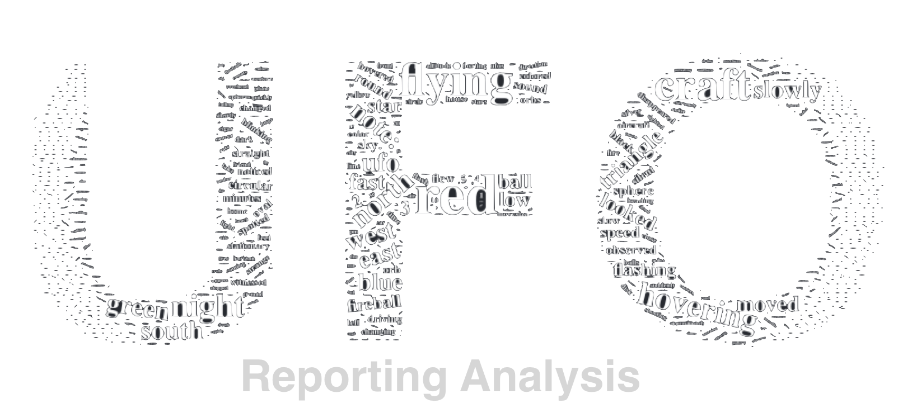

### By Eric Wong, Keegan Na, Kyle Sneddon, & Yicheng Duan
---

## The Data

We discovered a dataset containing over **80,000** reports of UFO sightings around the world over the last century. The dataset was originally created by **The National UFO Reporting Center** (NUFORC). To see the full dataset, click [here](https://www.kaggle.com/NUFORC/ufo-sightings)

## Audience

Our primary target audience includes anyone who finds any interest in UFOs who lives in the United States. Our dataset will allow our particular audience to get a better understanding of the different sighting patterns of UFOs over the last century. This patterns could potentially lead the audience to run into their very own UFO sighting if they live within the U.S.

## Inspiration

UFO's are super mysterious due to their rarity. Since their sightings are so minimal, there are plenty of unanswered questions that we believe our dataset could help answer.

Some questions we believe could be answered include:

-What areas of the country are most likely to have UFO sightings?

-Are there any trends in UFO sightings over time?

-Do the trends tend to be clustered or seasonal?

-Do clusters of UFO sightings correlate with landmarks, such as airports or government research centers?

-What are the most common UFO descriptions?

## Data Visualization

We created different data visualizations. Through visually displaying our answers, we hope this could better help answer the questions listed above.

#### U.S. Map

We created a map of the United States. On it, it displays all the different UFOs sightings that occurs over the past century. Our aim with this visualization was to allow users to visibly see the different sighting locations based on specific factors. Factors included the state in which the sighting was seen, the years in which the sightings happened and the shape of the UFO.

#### Donut Chart

We also created a donut chart. Our aim with this type of visualization was to allow the users to quickly and beautifully see different UFO sighting percentages based on the chosen filter. We provide three different filters to choose from. Filters include, state, shape and year.
